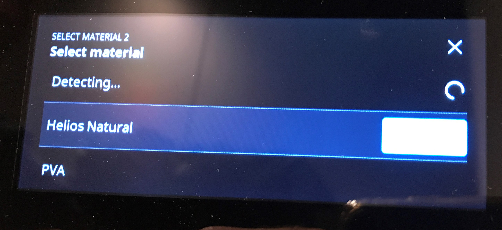

# Ultimaker S5

I am going to share my experiences with Ultimaker S5 here. My first "hack" is to add FormFutura filaments to the printers display menu, to properly support the load/unload capabilities. Similarily I will publish and update also Cura material profiles for selected FormFutura materials.

## Custom Material Upload Tool

Uploading filament profiles via REST API to printer to add custom print profiles. e.g. I wanted that ASA (FormFutura ApolloX) and high-temperature PVA (FormFuture Helios) is selectable in the touch display.

Therefore use the python tool (tested with Python 3.7+) ums5material.py

