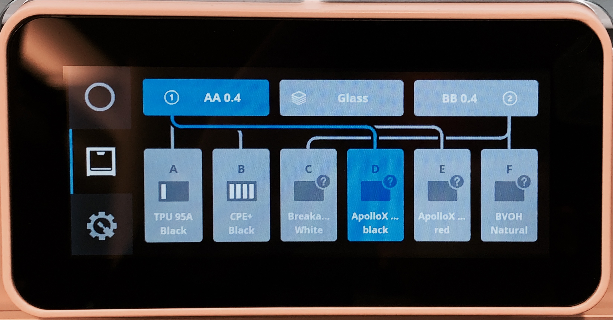
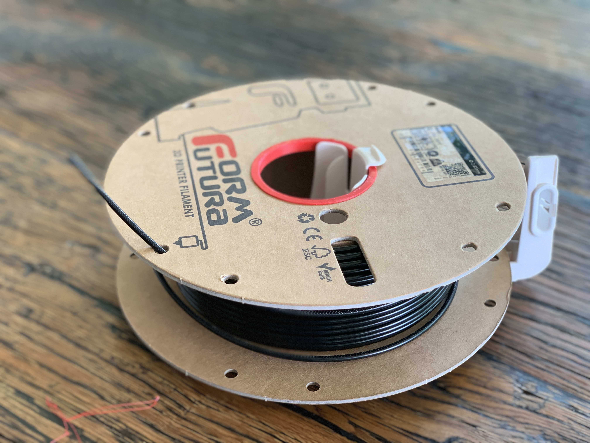

# Ultimaker S3/S5/S5/S7/ProBundle Material Profiles

## favorite materials
* FormFutura ApolloX (all colors)
* FormFutura BVOH
* Luvocom PAHT 9933BK 

## additional great materials
* FormFutura PythonFlex
* FormFutura CrystalFlex
* FormFutura HDglass PETG

## materials i stopped using
* FormFutura Helios PVA (I switched all soluble support to BVOH, which is much more reliable and no clogging any more.)

## __Luvocom PAHT 9933BK__ for robust parts
The biggest benefits of this Nylon material is much stronger inter-layer adhesion than ApolloX. Also it does not warp compared to other nylons. Prints well on Dimafix. Also it is fairly heat resistant.

This material is also available on the marketplace, but not optimized enough. Especially printing with 0.8mm Nozzle for larger parts caused lots of stringing. The profile lowered print temperature and increased retraction to reduce stringing. Drying the material upfront (12h 70°, or 4h 100°) is mandatory.

## __FormFutura ApolloX ASA__ for outdoor parts
There is a FormFutura ApolloX listed on the marketplace, but that one is STILL not  supporting material station properly, because it misses color and additional material profile settings. So choose this one and you should be fine.

ApolloX prints as easy as PLA, but is much more robust and perfectly suited for practical parts and outdoor use as it is water resistant, UV resistant and doesnt bend under the heat of the sun. The really only tradeoff is weaker interlayer adhesion.

* ASA Materials are updated and tested with Ultimaker S3/S5 Firmware 8.x and Cura 5.x
* The marketplace delivered ApolloX profiles are still as of v2.0.0 only providing the bare minimum, and have not been tuned for colors, material station, robustness, dimensional stability and more.
These profiles here are tuned for practical-use parts, with higher temperature for higher layer adhesion, and dimensional correctness also for larger prints. It is still super easy to print with Dimafix (or similar) in place.

## __FormFutura BVOH__ water soluble support material

Forget PVA, BVOH is so much . I had only troubles works so far much better than PVA. Prints easier, didnt clog so far my BB 0.4, dissolves much quicker than PVA in warm water. Can be combined with many filaments, including ASA - my favorite material. Had so much of clogging issues with original Ultimaker PVA that i stopped it. Had then issues with FormFutura Helios PVA too however

# Formfutura cardboard spool adapter for Ultimaker S5 and S3
FormFutura switched from plastic to cardboard spools recently. Great for environment, but problematic with Ultimaker spool holder, as the spools get stuck. This cardboard spool adapter for Ultimaker S3 and S5 will make it work again and uses little plastic. Printing two of these adapters solves the problem.

https://grabcad.com/library/formfutura-cardboard-spool-adapter-for-ultimaker-s3-and-s5-1