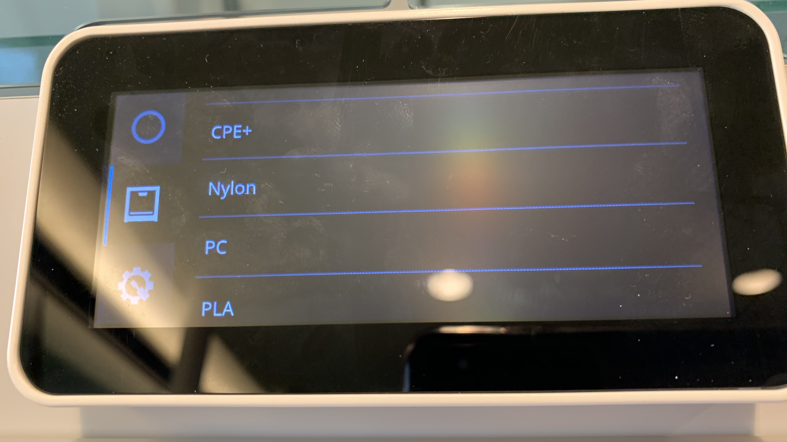
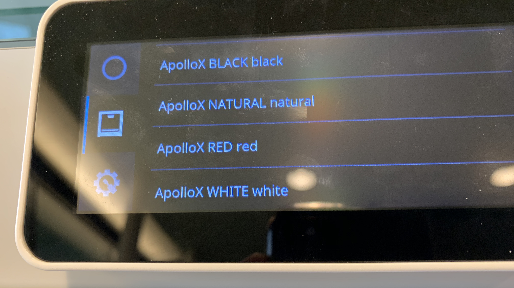
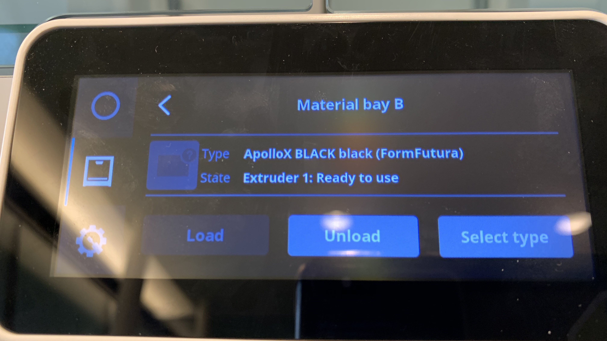
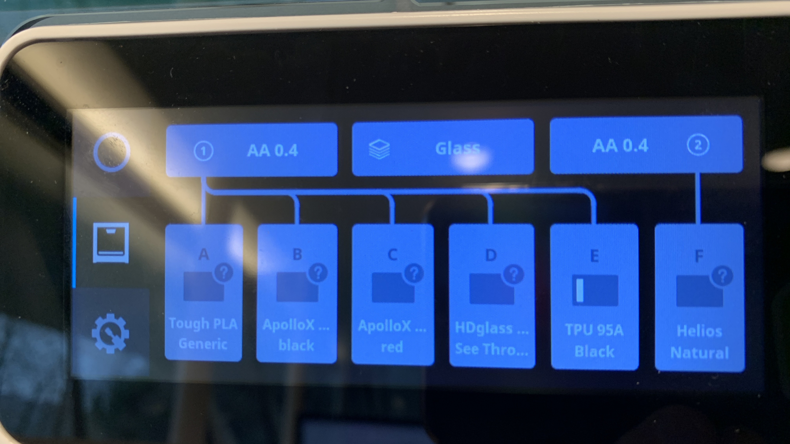

# Ultimaker S5 Materials Management Tool and FormFutura Materials

I am going to share my experiences with Ultimaker S5 and Ultimaker Material-station here. While a few FormFutura materials are now available in the Cura Marketplace for download, the issue is that it does not provide color information so that it can be assigned to a bay in material station. Furthermore do I use additional FormFutura materials alongside Ultimaker materials.

## Materials-Station
as of S5 Firmware 5.4.27.20191212 there is no color information displayed with materials. this is ok for NFC based ultimaker material with color auto-detection, but not when manually assigning a 3rd party material to a material station bay.


The workaround for now is to turn every color variant into a unique material. This is what i did here for e.g. with ApolloX material.


This is not nice as color info is now shown duplicate, but however, when importing those material profiles into cura, it all works fine.



and finally it looks then like this when you have the material station. A mix of Ultimaker and FormFutura materials installed.




## Custom Material Upload Tool

__NOTE: you can import these profiles into Cura and Cura will send the materials to Ultimaker S5 on the next restart of Cura.__ this way you do not need to use the python script to upload the profiles into the printer. But for listing installed materials and for deleting material profiles from the printer this tool is very handy.

Uploading filament profiles via REST API to printer to add custom print profiles. e.g. I wanted that ASA (FormFutura ApolloX) and high-temperature PVA (FormFuture Helios) is selectable in the touch display.


Therefore use the python tool (tested with Python 3.7+) ums5material.py

## Installing ums5material.py

### clone or copy from github

```
git clone https://github.com/flyinggorilla/ultimaker-s5.git
```

### install dependencies
```
python -m pip install requests
python -m pip install untangle
python -m pip install pyyaml
```

## Usage

### Help
```
python ums5material.py
```

note: on Linux you might need to use python3 instead.

```
Usage: ums5material.py [options] [ultimaker-url] [material-filename]

Options:
  -h, --help            show this help message and exit
  -f FILE, --file=FILE  Ultimaker S5 material XML file
  -u, --update          udpate to printer
  -l, --list            List materials on Ultimaker S5, provide optional
                        --filter string
  -F FILTER, --filter=FILTER
                        Filters listed materials filter string
  -g <guid>, --guid=<guid>
                        GUID of material
  -a <id>:<key>, --auth=<id>:<key>
                        digest authentication
  -s, --storeconfig     store given host and authentication information to
                        config file.
  -C, --createauth      create ID:KEY authentication credentials
                        writing/deleting materials. Please make sure to accept
                        authorization request on Ultimaker S5 printer display.
  -v, --verifyauth      Verify whether authentication against Ultimaker S5
                        REST api succeeds with provided ID/KEY.
  -d, --delete          delete material from printer with -g GUID or guid is
                        extracted from material xml file
```

## querying installed materials

option -l allows to list all installed materials. Option -s allows to store the hostname of Ultimaker S5 in the ums5material.config.yaml file so you dont have to retype it.

```
python ums5material.py -l -s http://ultimaker.local
```

an optional filter can be used with -F. in this example I query for installed FormFutura materials. Note that the Ultimaker S5 hostname/url is already automatically retrieved from the .config.yaml file.

```
python ums5material.py -l -F FormFutura 
```

results in this example output...
```
Material: FormFutura, Helios, Helios PVA, Natural, 5905b419-3c22-4530-aa64-eb8153b16e6e
Material: FormFutura, PythonFlex, PythonFlex TPU, Clear, 1ef7aea6-5634-4fc3-8d60-a04fcafe9ed5
Material: FormFutura, PETG, HDglass,  , ff6aaf9e-3fb0-420a-bd05-7a652eefeb80
Material: FormFutura, PythonFlex TPU, , Generic, 57d328ec-9b30-4c88-9158-7004035cd9d6
Material: FormFutura, ApolloX, ApolloX ASA, , e2383de0-2913-4777-b0f3-a03767d96529
Material: FormFutura, ASA, ApolloX, black, c99377f5-fbb4-4c3b-8f91-7a1d2c32e44f
Material: FormFutura, CrystalFlex, CrystalFlex SBC, Clear, a740135c-f874-4a14-99eb-15a04353d268
Material: FormFutura, Atlas, Atlas PVA, Natural, dd96bf72-866b-4770-b23e-e800e10e8cfa
```

## Modifying on-printer materials

### Create authorization token
modifying on-printer materials requires to have a token with proper permissions granted. you can use `ums5material.py` to create such a id/key token. You need to do this only once.

The option `-s` will store the ID/KEY credentials automatically in `ums5material.config.yaml` file so you dont need to type it for later use:

```
python ums5material.py -C -s
Keys generated: ID:KEY=8e54c3d79f35746547f06b9fd416d352:fa88da37b100807a7269d84a97381e4e6a8791191756f79dc28aa67c3bc7a382 200 {"id": "8e54c3d79f35746547f06b9fd416d352", "key": "fa88da37b100807a7269d84a97381e4e6a8791191756f79dc28aa67c3bc7a382"}
Please accept request on Ultimaker S5 display for application "ums5material.py" and user "flyinggorilla" to use keys.
```


### Upload material 
Now you have write access to upload and delete materials. 
But before you do this, ensure that your `.xml.fdm_material` file has a unique GUID, so especially when you manually copy an fdm_material you need to change the GUID. you can create GUIDs online on several sites, like the one here: https://www.guidgenerator.com

so your .xml.fdm_material should be updated like this...
```xml
<?xml version='1.0' encoding='utf-8'?>
<fdmmaterial version="1.3" 
  xmlns="http://www.ultimaker.com/material">
  <metadata>
    <name>
      <brand>FormFutura</brand>
      <material>PythonFlex</material>
      <color> </color>
      <!-- <label>Black PythonFlex TPU</label> -->
    </name>
    <GUID>57d328ec-9b30-4c88-9158-7004035cd9d6</GUID>
    <!-- <color_code>#000000</color_code> -->
    <compatible>True</compatible>
    <definition>fdmprinter</definition>
    <version>9</version>

...
...

```

so the following command will upload the new material. Note that the material will be overridden if it existed before

```
python ums5material.py -u FormFutura_PythonFlex_Generic.xml.fdm_material

Material filename: FormFutura_PythonFlex_Generic.xml.fdm_material
Contacting Ultimaker S5 at ultimaker.local with ID 082fba70255a02de03eb431c2dce774c
Material found: FormFutura PythonFlex PythonFlex TPU Generic 57d328ec-9b30-4c88-9158-7004035cd9d6
Deleted FormFutura_PythonFlex_Generic.xml.fdm_material: 200 {"message": "Remove successful", "result": true}
Posted FormFutura_PythonFlex_Generic.xml.fdm_material: 200 {"message": "Material profile stored", "result": true}
```

Note that the .dfm_material definitions with color information are good for Cura import. For the Ultimaker S5 printer display you should generate a Generic profile that has a single space character as `<color> </color>` definition. So you dont need to send the color versions to the printer.